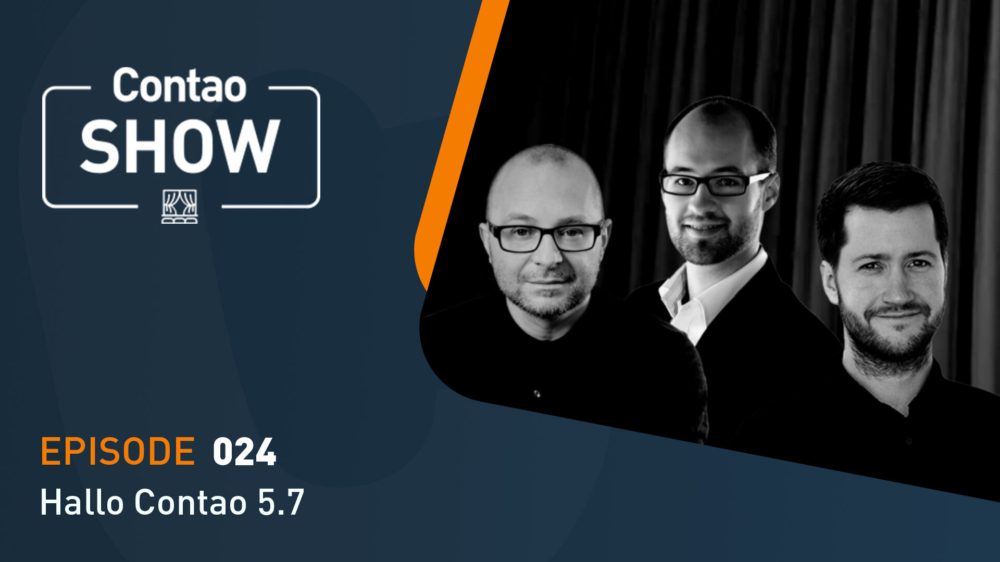

# Contao Show #24

Hier findest du meine Beispiele aus der Contao Show #24 vom 25.02.2026.

Die Show findest du hier auf YouTube: https://to.contao.org/tv/show/24

## Loupe-Integration 🔍

```
composer require contao/loupe-bridge
```

Script zur lokalen Ausführung des Contao-Cronjobs

```
#!/bin/bash
while true
do
  echo "Der Contao Cron läuft ($(date '+%H:%M') Uhr)"
  php bin/console contao:cron
  sleep 30
done
```

## Beispiel-Twig-Filter ☕️

### Zufälliges Emoji

randomEmoji

```

    {{ headline.text|insert_tag_raw|randomEmoji }}

```

   
### Hervorgehobene Nachrichten mit ⭐️ markieren

isFeatured

```
<h2>{{ linkHeadline|sanitize_html('contao')|isFeatured(featured)|raw }}</h2>
```

   
### Text sinnvoll kürzen

smartTruncate

```
{{ teaser|default|sanitize_html('contao')|csp_inline_styles|insert_tag_raw|smartTruncate(120)|raw }}
```

